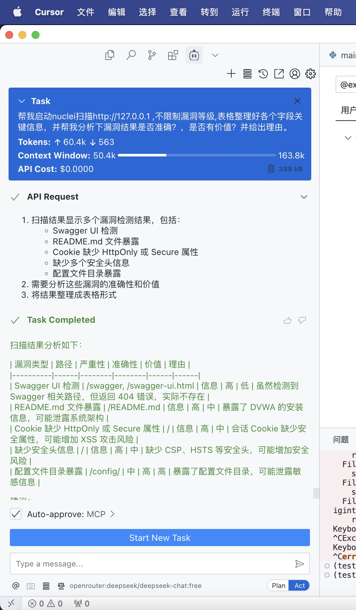

[](https://mseep.ai/app/crazymarky-mcp-nuclei-server)

# MCP Nuclei Server

[](https://www.python.org/downloads/)
[](LICENSE)
[](https://github.com/crazyMarky/mcp_nuclei_server)
[](README.zh-cn.md)

A Nuclei security scanning server based on MCP (Model Control Protocol), providing convenient vulnerability scanning services.

## Project Introduction

MCP Nuclei Server is a Nuclei security scanning service developed based on the MCP protocol. It allows large language models to execute Nuclei security scans, supporting various scanning options and result output formats.

Key Features:
- Support for Nuclei security scanning
- Configurable template and tag filtering
- Support for severity-based vulnerability filtering
- JSON format output results
- Easy-to-integrate MCP service

## Installation Guide

### Prerequisites

- Python 3.8 or higher
- Nuclei binary (installed and configured)

### Installation Steps

1. Clone the repository:
```bash
git clone https://github.com/crazyMarky/mcp_nuclei_server.git
cd mcp_nuclei_server
```

2. Install UV and activate environment:
```bash
curl -LsSf https://astral.sh/uv/install.sh | sh # Linux/Mac
powershell -ExecutionPolicy ByPass -c "irm https://astral.sh/uv/install.ps1 | iex"  # Windows
```

3. Install dependencies:
```bash
# Create and activate virtual environment
uv venv
source .venv/bin/activate
# Install mcp related packages
uv pip install mcp
```

## Usage Guide

### MCP Configuration (Example for CLINE)

1. Reference MCP JSON configuration:
```json
{
  "mcpServers": {
    "nuclei_mcp_server": {
      "command": "/path/to/uv", # path to uv
      "args": [
        "--directory",
        "/path/to/nuclei_mcp_server/",
        "run",
        "main.py"
      ],
      "env": {
        "NUCLEI_BIN_PATH": "/path/to/nuclei"
      }
    }
  }
}
```

### Usage Example


### Parameter Description

- `target`: Target URL or IP address
- `templates`: List of specific templates to use (optional)
- `severity`: Vulnerability severity filter (critical, high, medium, low, info)
- `template_tags`: Template tag filter (optional)
- `output_format`: Output format (default: "json")

## Output Format

Scan results are returned in JSON format with the following fields:

```json
{
    "success": true,
    "target": "https://example.com",
    "time_cost_seconds": 10.5,
    "results": [
        {
            "template": "template-name",
            "severity": "high",
            "matched_at": "https://example.com/path",
            "info": {
                "name": "Vulnerability Name",
                "description": "Vulnerability Description"
            }
        }
    ]
}
```

## Contributing

Issues and Pull Requests are welcome!

1. Fork the project
2. Create your feature branch (`git checkout -b feature/AmazingFeature`)
3. Commit your changes (`git commit -m 'Add some AmazingFeature'`)
4. Push to the branch (`git push origin feature/AmazingFeature`)
5. Open a Pull Request

## License

This project is licensed under the MIT License - see the [LICENSE](LICENSE) file for details

## Contact

For any questions or suggestions, please contact us through:
- Submit an Issue 