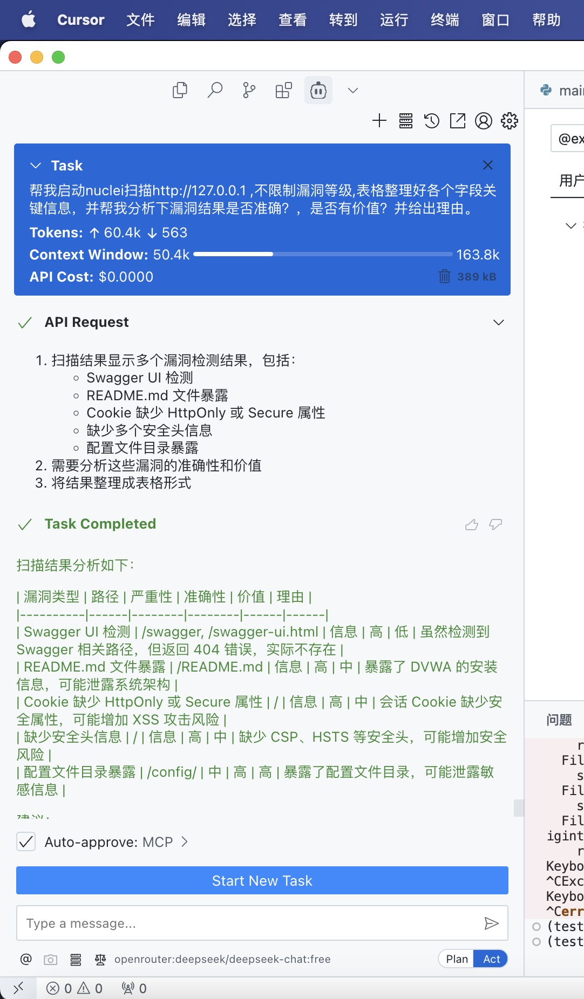

# MCP Nuclei 服务器

[](https://www.python.org/downloads/)
[](LICENSE)
[](https://github.com/crazyMarky/mcp_nuclei_server)
[](README.md)

一个基于 MCP (Model Control Protocol) 的 Nuclei 安全扫描服务器，提供便捷的漏洞扫描服务。

## 项目介绍

MCP Nuclei Server 是一个基于 MCP 协议开发的 Nuclei 安全扫描服务。它允许大模型来执行 Nuclei 安全扫描，支持多种扫描选项和结果输出格式。

主要特性：
- 支持 Nuclei 安全扫描
- 可配置的模板和标签过滤
- 支持按严重程度筛选漏洞
- JSON 格式输出结果
- 易于集成的 MCP 服务

## 安装说明

### 前提条件

- Python 3.8 或更高版本
- Nuclei 二进制文件（已安装并配置）

### 安装步骤

1. 克隆仓库：
```bash
git clone https://github.com/crazyMarky/mcp_nuclei_server.git
cd mcp_nuclei_server
```

2. 安装UV并激活环境：
```bash
curl -LsSf https://astral.sh/uv/install.sh | sh # Linux/Mac
powershell -ExecutionPolicy ByPass -c "irm https://astral.sh/uv/install.ps1 | iex"  # Windows
```

3. 安装依赖：
```bash
# 创建虚拟环境并激活它
uv venv
source .venv/bin/activate
# 安装mcp相关的包
uv pip install mcp
```
 
## 使用方法

### 配置MCP（举例CLINE）

1、参考mcp的json配置：
```json
{
  "mcpServers": {
    "nuclei_mcp_server": {
      "command": "/path/to/uv", #uv的路径
      "args": [
        "--directory",
        "/path/to/nuclei_mcp_server/",
        "run",
        "main.py"
      ],
      "env": {
        "NUCLEI_BIN_PATH": "/path/to/nuclei"
      }
    }
  }
}
```
### 调用示例


### 参数说明

- `target`: 目标 URL 或 IP 地址
- `templates`: 要使用的特定模板列表（可选）
- `severity`: 漏洞严重程度过滤（critical, high, medium, low, info）
- `template_tags`: 模板标签过滤（可选）
- `output_format`: 输出格式（默认为 "json"）

## 输出格式

扫描结果以 JSON 格式返回，包含以下字段：

```json
{
    "success": true,
    "target": "https://example.com",
    "time_cost_seconds": 10.5,
    "results": [
        {
            "template": "template-name",
            "severity": "high",
            "matched_at": "https://example.com/path",
            "info": {
                "name": "Vulnerability Name",
                "description": "Vulnerability Description"
            }
        }
    ]
}
```

## 贡献指南

欢迎提交 Issue 和 Pull Request！

1. Fork 项目
2. 创建特性分支 (`git checkout -b feature/AmazingFeature`)
3. 提交更改 (`git commit -m 'Add some AmazingFeature'`)
4. 推送到分支 (`git push origin feature/AmazingFeature`)
5. 开启 Pull Request

## 许可证

本项目采用 MIT 许可证 - 详情请参阅 [LICENSE](LICENSE) 文件

## 联系方式

如有任何问题或建议，请通过以下方式联系我们：
- 提交 Issue